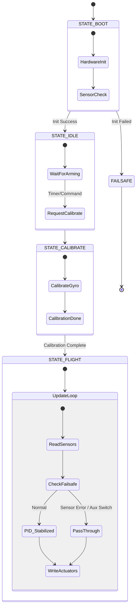

# Flight Controller Firmware (NXP RT1011)

This repository contains the embedded C++ firmware for a custom flight controller based on the **NXP i.MX RT1011 (ARM Cortex-M7)** microcontroller. The system is built on **FreeRTOS** and utilizes a modular, object-oriented architecture to manage sensor fusion, flight control laws, and actuator outputs in real-time.

## 🚀 Features

* **Real-Time Operating System**: Built on FreeRTOS v10.5.1 with static memory allocation for deterministic behavior.
* **Control Modes**:
    * **Stabilized Mode**: Angle-based PID control with coordinated turn capabilities.
    * **Pass-Through Mode**: Direct mapping of RC inputs to servos for manual control.
* **Sensor Fusion**:
    * AHRS (Attitude and Heading Reference System) using the Madgwick algorithm.
    * Online Recursive Least Squares (RLS) Magnetometer Calibration.
* **Connectivity**:
    * **RC Protocol**: FlySky IBUS protocol support using DMA and Idle Line detection for low-latency input.
    * **Telemetry**: Real-time logging of sensor data and PID outputs via debug console.
* **Safety**:
    * Failsafe state triggering on initialization failure.
    * Watchdog-like hardfault handling for semihosting environments.

## 🛠 Hardware Architecture

### Target Platform
* **MCU**: NXP i.MX RT1011 (MIMXRT1011)
* **Clock Speed**: 500 MHz (Configured via `clock_config.h`)

### Peripherals & Pinout

| Peripheral | Component | Details |
| :--- | :--- | :--- |
| **LPI2C1** | IMU / Mag | Shared bus for LSM6DSOX and LIS3MDL. |
| **LPUART1** | RC Receiver | Configured for IBUS (115200 baud, 8N1). Uses DMA Channel 0. |
| **PWM1 Mod 0 A** | Servo | Aileron Output. |
| **PWM1 Mod 0 B** | Servo | Elevator Output. |
| **PWM1 Mod 2 A** | ESC | Throttle Output. |
| **PWM1 Mod 2 B** | Servo | Rudder Output. |

### Supported Sensors
* **Accelerometer/Gyroscope**: STMicroelectronics LSM6DSOX.
* **Magnetometer**: STMicroelectronics LIS3MDL.

## 📂 Software Architecture

The application is structured around a central **State Manager** that controls the lifecycle of various FreeRTOS tasks.

### State Machine
1.  **BOOT**: Hardware initialization and sensor self-checks.
2.  **IDLE**: System standby, waiting for arming/calibration commands.
3.  **CALIBRATE**: Performs sensor bias calculation.
4.  **FLIGHT**: High-frequency (100Hz) control loop execution.
5.  **FAILSAFE**: Error state with reduced functionality.

### Key Modules
* **`FlightController`**: The main facade class coordinating the IMU, Receiver, and AttitudeController.
* **`AttitudeController`**: Implements cascaded PID logic (Rate and Angle loops).
* **`ServoDriver`**: Abstraction over NXP FSL PWM drivers, handling microsecond-to-tick conversion.
* **`IbusHandler`**: Zero-copy parser for RC packets using C++23 `std::span`.

## 🔨 Build & Development

### Toolchain Requirements
* **IDE**: MCUXpresso IDE.
* **Compiler**: GNU Arm Embedded Toolchain.
* **Standard**: **C++23** (GNU C++23) and **C17** (GNU C17).
* **SDK**: NXP MCUXpresso SDK for EVK-MIMXRT1011.

### Style Guide
This project enforces a strict coding style:
* **Indentation**: 4 Spaces.
* **Naming**: `PascalCase` (Classes), `camelCase` (Methods/Variables), `snake_case` (C-Structs/Files).
* **Memory**: No dynamic allocation (heap) permitted; use `xTaskCreateStatic` and static buffers.

### Compilation
1.  Import the project into MCUXpresso.
2.  Ensure the C++ dialect is set to **C++23**.
3.  Verify the preprocessor symbol `CPP_NO_HEAP` is defined to disable `malloc`/`free` stubs.
4.  Build the `Debug` or `Release` configuration.

## 🕹 Usage

### RC Channel Mapping (AETR)
* **Channel 1**: Roll
* **Channel 2**: Pitch
* **Channel 3**: Throttle
* **Channel 4**: Yaw
* **Channel 5 (AUX1)**: Mode Switch (Low = Stabilized, High = Pass-Through).

### Calibration
To enter calibration mode, ensure the system is in **IDLE** and trigger the calibration request via the state queue (logic implemented in `idleTask`). The system will perform gyro bias calculation and return to IDLE upon completion.

## 📄 License
This project is provided "AS IS" without warranty of any kind. See `freertos_config.h` for FreeRTOS licensing details.
