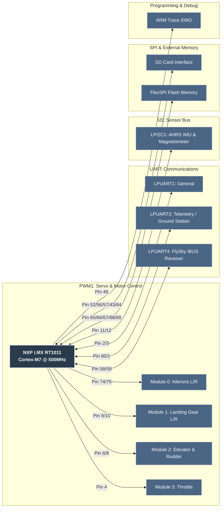
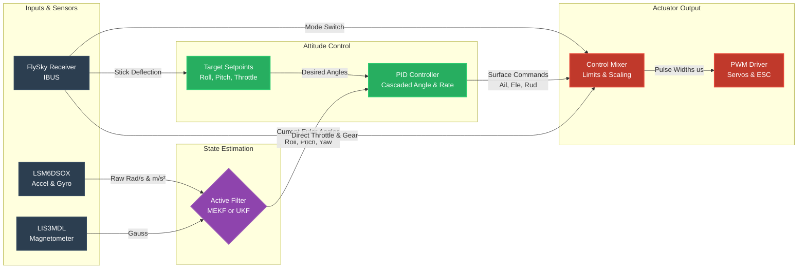
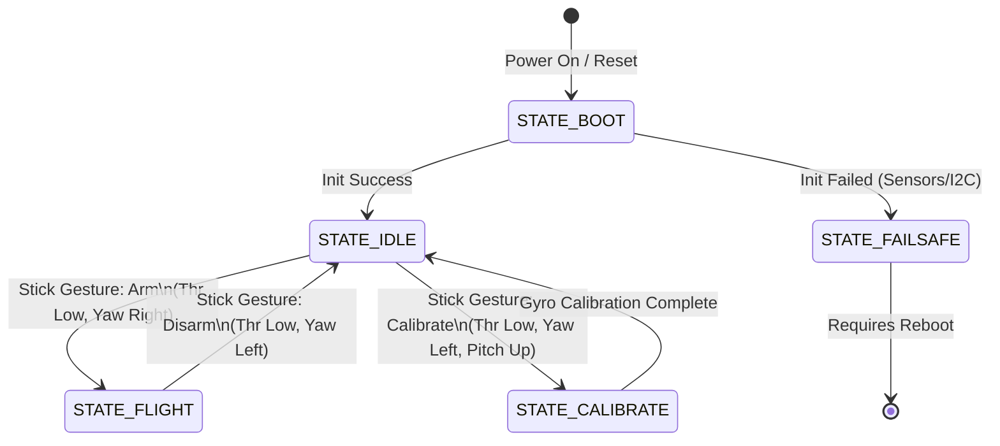

# Flight Controller Firmware (NXP RT1011)

This repository contains the embedded C++ firmware for a custom flight controller based on the **NXP i.MX RT1011 (ARM Cortex-M7)** microcontroller. The system is built on **FreeRTOS** and utilizes a modular, object-oriented architecture to manage sensor fusion, flight control laws, and actuator outputs in real-time.

## Features

* **Real-Time Operating System**: Built on FreeRTOS v10.5.1 with static memory allocation for deterministic behavior.
* **Control Modes**:
    * **Stabilized Mode**: Angle-based PID control with coordinated turn capabilities.
    * **Pass-Through Mode**: Direct mapping of RC inputs to servos for manual control.
* **Sensor Fusion**:
    * AHRS utilizing a Multiplicative Extended Kalman Filter (MEKF) or Unscented Kalman Filter (UKF), selectable at compile time.
    * Online Recursive Least Squares (RLS) Magnetometer Calibration.
* **Connectivity**:
    * **RC Protocol**: FlySky IBUS protocol support using DMA and Idle Line detection for low-latency input.
    * **Telemetry**: High-speed real-time logging (100Hz via USB / 10Hz via UART) of sensor data, RC commands, and system status.
* **Ground Station**: Includes `runViz.py`, a PyQt6/PyQtGraph-based ground station for 3D attitude visualization, live RC input monitoring, and interactive 3D ellipsoid fitting for magnetometer calibration.
* **Safety**:
    * Failsafe state triggering on initialization failure.
    * Watchdog-like hardfault handling for semihosting environments.

## Hardware Architecture

### Target Platform
* **MCU**: NXP i.MX RT1011 (MIMXRT1011DAE5A)
* **Core**: Cortex-M7F running at 500 MHz

### Pinout Mapping

#### Pulse Width Modulation (PWM) - Motors & Servos
All configured PWM signals are routed from the **PWM1** peripheral block and explicitly mapped in `actuators.cpp`.

| Pin | MCU Signal | Function / Label | Module & Channel |
| :--- | :--- | :--- | :--- |
| **74** | GPIO_SD_02 | PWM0A | PWM1, Module 0, Channel A (Aileron Left) |
| **75** | GPIO_SD_01 | PWM0B | PWM1, Module 0, Channel B (Aileron Right) |
| **9** | GPIO_04 | PWM1A | PWM1, Module 1, Channel A (Gear Left) |
| **10** | GPIO_03 | PWM1B | PWM1, Module 1, Channel B (Gear Right) |
| **6** | GPIO_06 | PWM2A | PWM1, Module 2, Channel A (Elevator) |
| **8** | GPIO_05 | PWM2B | PWM1, Module 2, Channel B (Rudder) |
| **4** | GPIO_08 | PWM3A | PWM1, Module 3, Channel A (Throttle) |

#### UART - Serial Communications

| Pin | MCU Signal | Function / Label | Subsystem / Notes |
| :--- | :--- | :--- | :--- |
| **3** | GPIO_09 | UART1_RXD | LPUART1 |
| **2** | GPIO_10 | UART1_TXD | LPUART1 |
| **1** | GPIO_11 | UART3_RXD | LPUART3 (Telemetry) |
| **80** | GPIO_12 | UART3_TXD | LPUART3 (Telemetry) |
| **59** | GPIO_AD_01 | UART4_RXD | LPUART4 (IBUS Receiver) |
| **58** | GPIO_AD_02 | UART4_TXD | LPUART4 (IBUS Receiver) |

#### I2C - Sensors
The I2C pins are configured with internal 22K Ohm pull-up resistors and open-drain enabled.

| Pin | MCU Signal | Function / Label |
| :--- | :--- | :--- |
| **11** | GPIO_02 | LPI2C1_SCL |
| **12** | GPIO_01 | LPI2C1_SDA |

#### SPI / SD Card Interface & Memory

| Pin | MCU Signal | Function / Label |
| :--- | :--- | :--- |
| **52** | GPIO_AD_06 | SD_CLK |
| **56** | GPIO_AD_04 | SD_MOSI |
| **57** | GPIO_AD_03 | SD_MISO |
| **43** | GPIO_AD_14 | SD_CS |
| **64** | GPIO_SD_11 | SD_CD (Card Detect) |
| **65** | GPIO_SD_10 | FlexSPI_CLK (Flash) |
| **69** | GPIO_SD_06 | FlexSPI_SS0 (Flash CS) |

### Hardware Block Diagram

```mermaid
graph LR
    %% Main Microcontroller
    MCU[NXP i.MX RT1011 <br> Cortex-M7 @ 500MHz]

    %% Actuators & PWM
    subgraph Actuators [PWM1: Servo & Motor Control]
        MCU -->|Pin 74/75| M0[Module 0: Ailerons L/R]
        MCU -->|Pin 9/10| M1[Module 1: Landing Gear L/R]
        MCU -->|Pin 6/8| M2[Module 2: Elevator & Rudder]
        MCU -->|Pin 4| M3[Module 3: Throttle]
    end

    %% Serial Communications
    subgraph Serial [UART Communications]
        MCU <-->|Pin 2/3| UART1[LPUART1: General]
        MCU <-->|Pin 80/1| UART3[LPUART3: Telemetry / Ground Station]
        MCU <-->|Pin 58/59| UART4[LPUART4: FlySky IBUS Receiver]
    end

    %% I2C Bus
    subgraph I2C [I2C Sensor Bus]
        MCU <-->|Pin 11/12| I2C1[LPI2C1: AHRS IMU & Magnetometer]
    end

    %% SPI and Storage
    subgraph Storage [SPI & External Memory]
        MCU <-->|Pin 52/56/57/43/64| SD[SD Card Interface]
        MCU <-->|Pin 65/66/67/68/69| FLASH[FlexSPI Flash Memory]
    end

    %% Debugging
    subgraph Debug [Programming & Debug]
        MCU -->|Pin 48| SWO[ARM Trace SWO]
    end

    %% Styling
    classDef mcu fill:#2a3b4c,stroke:#fff,stroke-width:2px,color:#fff,font-weight:bold;
    classDef peripheral fill:#4b6584,stroke:#a5b1c2,stroke-width:1px,color:#fff;
    
    class MCU mcu;
    class M0,M1,M2,M3,UART1,UART3,UART4,I2C1,SD,FLASH,SWO peripheral;
```

## System Controller

```mermaid
flowchart LR
    %% Inputs
    subgraph Inputs [Inputs & Sensors]
        RC[FlySky Receiver\nIBUS]
        IMU[LSM6DSOX\nAccel & Gyro]
        MAG[LIS3MDL\nMagnetometer]
    end

    %% State Estimation
    subgraph Estimator [State Estimation]
        FILTER{Active Filter\nMEKF or UKF}
    end

    %% Control Laws
    subgraph Control [Attitude Control]
        SETPOINT[Target Setpoints\nRoll, Pitch, Throttle]
        PID[PID Controller\nCascaded Angle & Rate]
    end

    %% Outputs
    subgraph Outputs [Actuator Output]
        MIX[Control Mixer\nLimits & Scaling]
        PWM[PWM Driver\nServos & ESC]
    end

    %% Routing
    IMU -->|Raw Rad/s & m/s²| FILTER
    MAG -->|Gauss| FILTER
    RC -->|Mode Switch| MIX
    RC -->|Stick Deflection| SETPOINT

    FILTER -->|Current Euler Angles\nRoll, Pitch, Yaw| PID
    SETPOINT -->|Desired Angles| PID

    PID -->|Surface Commands\nAil, Ele, Rud| MIX
    RC -->|Direct Throttle & Gear| MIX

    MIX -->|Pulse Widths us| PWM

    %% Styling
    classDef input fill:#2c3e50,stroke:#34495e,stroke-width:2px,color:#fff
    classDef compute fill:#8e44ad,stroke:#9b59b6,stroke-width:2px,color:#fff
    classDef control fill:#27ae60,stroke:#2ecc71,stroke-width:2px,color:#fff
    classDef output fill:#c0392b,stroke:#e74c3c,stroke-width:2px,color:#fff

    class RC,IMU,MAG input
    class FILTER compute
    class SETPOINT,PID control
    class MIX,PWM output
```

## System State Machine

```mermaid
stateDiagram-v2
    [*] --> STATE_BOOT : Power On / Reset
    
    STATE_BOOT --> STATE_IDLE : Init Success
    STATE_BOOT --> STATE_FAILSAFE : Init Failed (Sensors/I2C)

    STATE_IDLE --> STATE_FLIGHT : Stick Gesture: Arm\n(Thr Low, Yaw Right)
    STATE_IDLE --> STATE_CALIBRATE : Stick Gesture: Calibrate\n(Thr Low, Yaw Left, Pitch Up)
    
    STATE_CALIBRATE --> STATE_IDLE : Gyro Calibration Complete
    
    STATE_FLIGHT --> STATE_IDLE : Stick Gesture: Disarm\n(Thr Low, Yaw Left)
    
    STATE_FAILSAFE --> [*] : Requires Reboot
```
